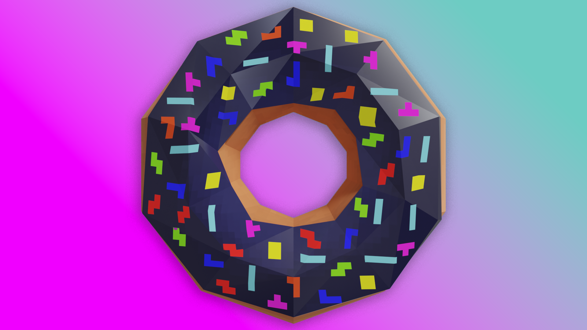

Esse pode não parecer um dos modelos mais impressionantes, mas ele tem uma história bem legal por trás.

Em 2022, Andrew Price, mais conhecido como [Blender Guru](https://www.youtube.com/@blenderguru), o maior canal de tutoriais de Blender no YouTube, criou uma campanha colaborativa para arrecadar dinheiro para a [Blender Foundation](https://www.blender.org/about/foundation/), e como admiro muito a iniciativa do software livre, e devo muito do que sei hoje em dia ao Andrew, decidir contribuir.

 
<iframe padding="100px" class="video" src="https://www.youtube.com/embed/jv3GijkzIdk?si=D-Wo5tgie9usls8z" title="YouTube video player" frameborder="0" allow="accelerometer; autoplay; clipboard-write; encrypted-media; gyroscope; picture-in-picture; web-share" referrerpolicy="strict-origin-when-cross-origin" allowfullscreen></iframe>

A campanha pedia que cada artista que quisesse participar, fizesse uma rosquinha em 3D, inspirado nos tutoriais do Andrew, que de tão populares viraram quase que uma marca de quem está aprendendo modelagem 3D no Blender, ao ponto de ser referenciado no maravilhoso filme [Tudo em Todo o Lugar ao Mesmo Tempo](https://www.linkedin.com/posts/andrew-price-17678911_apparently-my-donut-tutorial-influenced-the-activity-7033524636797595648-pWB0/), vencedor de sete Oscars, incluindo melhor filme.

Então ele reuniu o trabalho de todos os 17,731 artistas contribuíram numa [única peça](https://andrewprice.art/17731-first-steps) para ser leiloada, e selecionou os 30 melhores donuts para serem leiloados individualmente, e eu fui [um dos escolhidos!](https://opensea.io/assets/ethereum/0x495f947276749ce646f68ac8c248420045cb7b5e/52497038234800833041189910550809680081297599854390804766694516516381234561025)

{}

 <iframe class="square" title="Tetris Doughnut" frameborder="0" allowfullscreen mozallowfullscreen="true" webkitallowfullscreen="true" allow="autoplay; fullscreen; xr-spatial-tracking" xr-spatial-tracking execution-while-out-of-viewport execution-while-not-rendered web-share src="https://sketchfab.com/models/1aec175ca4d1439a8adc0026b6c3ba4f/embed?autostart=1&camera=0&ui_theme=dark"> </iframe> 

{}
